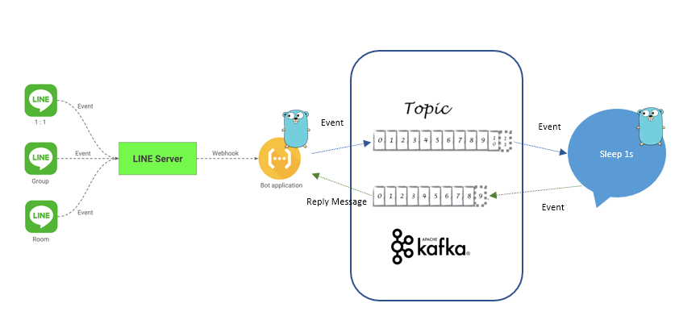
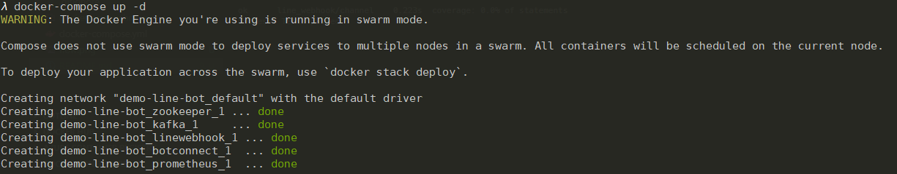
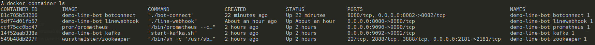

LineBot with Kafka Flow:



Update line secret and access token in docker-compose.yml

```
  linewebhook:
    .
    .
    .
    environment:
        CHANNEL_SECRET: <your secret> 
        CHANNEL_ACCESS_TOKEN: <your access token>
```

RUN: 
```
    docker-compose up -d
```

```
    docker container ls
```



webhook listen port 8080